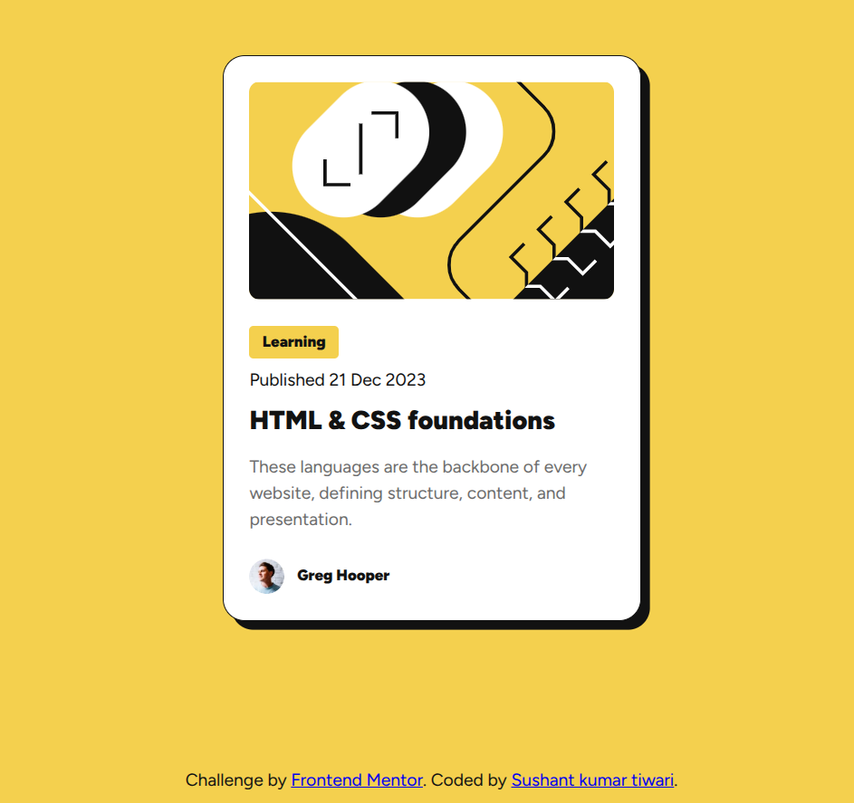

# Frontend Mentor - Blog preview card solution

This is a solution to the [Blog preview card challenge on Frontend Mentor](https://www.frontendmentor.io/challenges/blog-preview-card-ckPaj01IcS). Frontend Mentor challenges help you improve your coding skills by building realistic projects.

## Table of contents

- [Overview](#overview)
  - [The challenge](#the-challenge)
  - [Screenshot](#screenshot)
  - [Links](#links)
- [My process](#my-process)
  - [Built with](#built-with)
  - [What I learned](#what-i-learned)

## Overview

### The challenge

Users should be able to:

- See hover and focus states for all interactive elements on the page

### Screenshot



### Links

- Solution URL: [Solution link](https://github.com/Sandy-SandBox/blog-preview-card)
- Live Site URL: [Live site link](https://sandy-sandbox.github.io/blog-preview-card/)

## My process

### Built with

- Semantic HTML5 markup
- CSS custom properties
- Flexbox
- CSS Grid

### What I learned

I have recently started using to BEM to name css classes but was confused for a while about naming the child element as a nested element or independent block, but i figured out BEM is pretty simple to use and it gives a kind of structure to the code.

I also used the `clamp()` to give padding to the Blog card instead of giving it a fixed padding. It made the card more fluid as the padding decreased on smaller screens but stayed consistent on bigger screens.

```css
.blog {
  padding: clamp(var(--space-m), 3vw, var(--space-x));
}
```

I also used css custom properties to have a consistent font sizes, paddings and spacing:

```css
:root {
  /* Fonts */
  --ff-primary: "Figtree", sans-serif;

  --fz-heading: 1.5rem;
  --fz-body: 1rem;
  --fz-sm: 0.875rem;

  --fw-default: 400;
  --fw-medium: 500;
  --fw-bold: 700;
  --fw-extra-bold: 900;

  /* Colors */
  --clr-primary: hsl(47, 88%, 63%);
  --clr-gray-900: hsl(0, 0%, 7%);
  --clr-gray-500: hsl(0, 0%, 42%);
  --clr-white: hsl(0, 0%, 100%);

  /* Border radius */
  --br-card: 20px;
  --br-medium: 10px;
  --br-small: 4px;

  /* Box shadows */
  --bs-default: 0 10px 20px hsla(217, 45%, 22%, 0.1);

  /* Spacing */

  --space-x: 1.5rem; /* 24px */
  --space-l: 0.75rem; /* 12px */
  --space-m: 0.5rem; /* 8px */
  --space-s: 0.25rem; /* 4px */
}
```

I used semantic `Published <time datetime="2023-12-21">21 Dec 2023</time>` tag to wrap the "published date" inside it.

## Author

- Website - [Sushant]()
- Frontend Mentor - [@yourusername](https://sushantz.netlify.app/)
